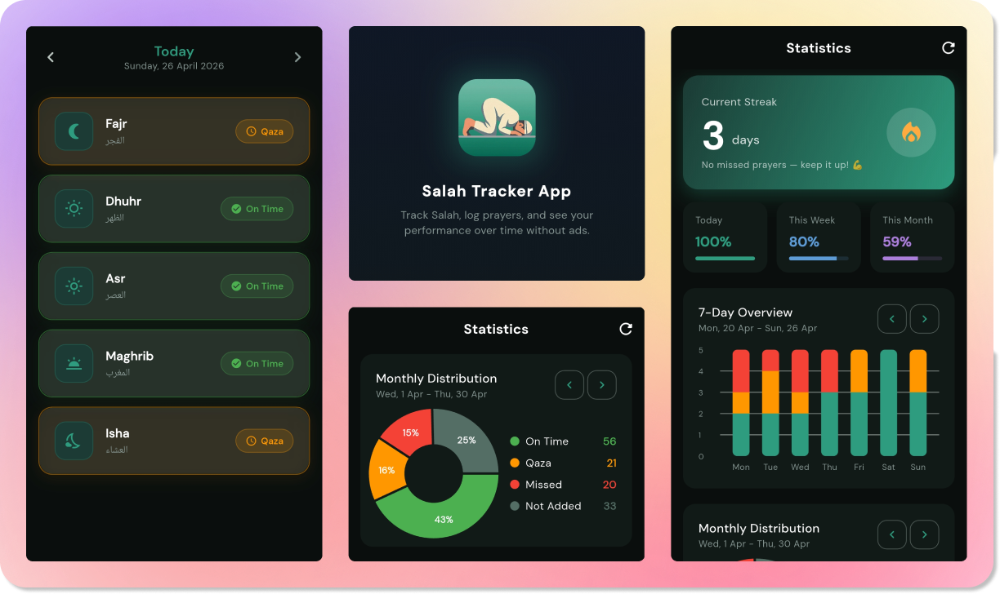

# 🕋 Salah Tracker Web

  
   
  

 

A premium, mindful prayer companion for the modern Muslim. **Salah Tracker App** is designed to help you build consistency in your spiritual journey through effortless logging, insightful analytics, and a beautiful, distraction-free interface.

> [!NOTE]
> This repository contains the web landing page and companion site for the Salah Tracker ecosystem.

---

## ✨ Key Features

- **🚫 100% Ad-Free**: No interruptions, no banners, no distractions. Just you and your goals.
- **📝 Effortless Logging**: Track Fajr, Dhuhr, Asr, Maghrib, and Isha with a single tap.
- **📊 Advanced Analytics**:
  - Dynamic dashboard with completion rates.
  - 7-Day stacked bar charts for habit visualization.
  - Weekly distribution pie charts.
- **🔥 Build Your Streak**: Stay motivated with a persistent streak counter.
- **🔒 Secure Cloud Sync**: Google Sign-In support via Supabase to keep your data safe across devices.
- **🌓 Dynamic UI**: Support for Light, Dark, and System theme modes with premium glassmorphism effects.
- **🌍 Multilingual**: Fully localized in English and Bangla (বাংলা).

---

## 🚀 Tech Stack

- **Structure**: Semantic HTML5
- **Styling**: [Tailwind CSS](https://tailwindcss.com/) for a modern, responsive interface.
- **Animations**: [GSAP](https://greensock.com/gsap/) for smooth, reveal-on-scroll transitions.
- **Interactivity**: Vanilla JavaScript for theme switching and UI logic.

---

## 🤝 Support the Mission

If you benefit from this project, consider giving **Sadaqah** to support maintenance and future development:

- **International**: [Donate via Stripe](https://donate.stripe.com/3cI8wO6bWcqd7F46az8AE01)
- **Bangladesh**: bKash Send Money to `01773615582` (Personal)

---

## ⚖️ License

Distributed under the MIT License. See `LICENSE` for more information.

---

Built with ❤️ by [Sahed Alom Sumit](https://sahedalomsumit.com)
